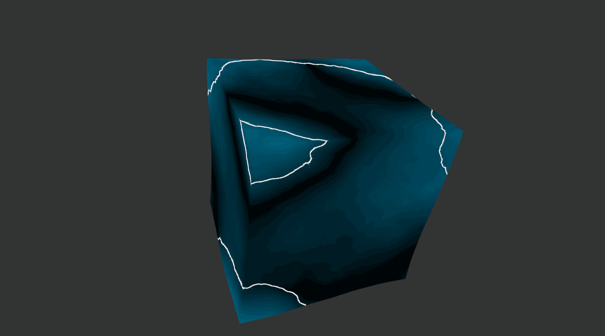
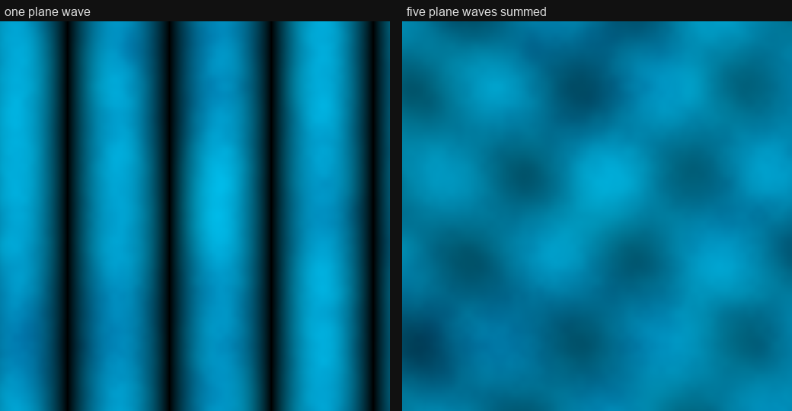
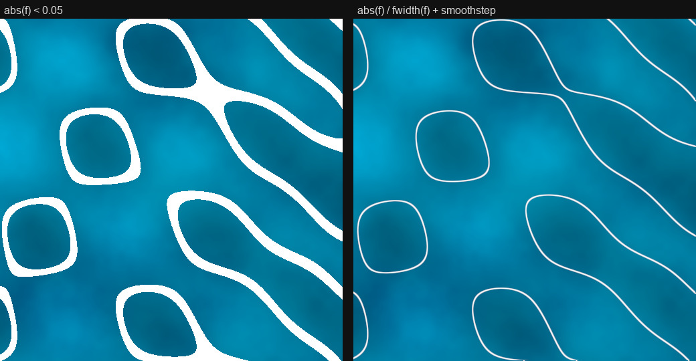
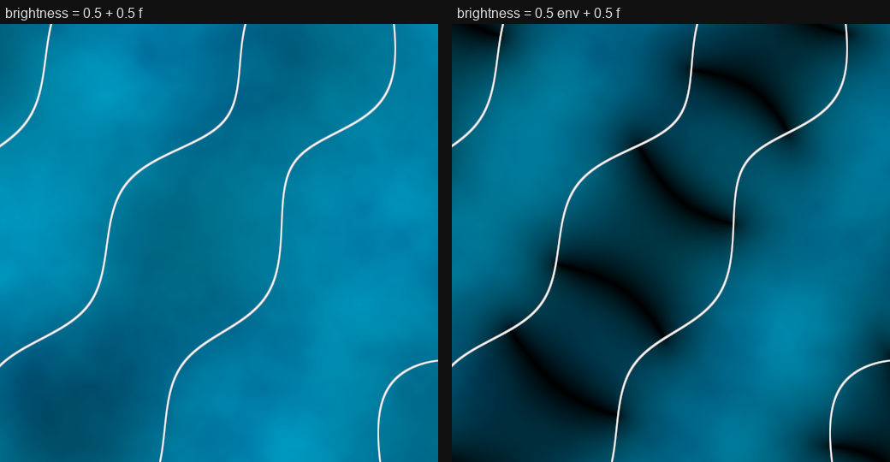
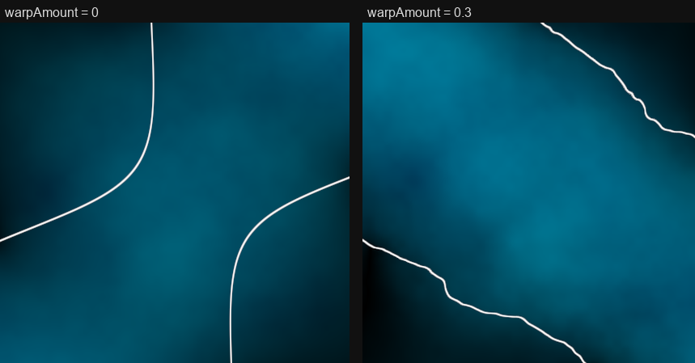
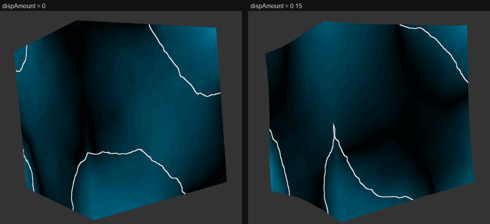

# Wave Interference on a Cube
> Original codebase forked from CIS 5660 HW0

A slowly tumbling cube with a wave-interference pattern on its surface. Five
plane waves are added together, the places where the sum is zero are drawn as
thin white lines, and the same sum pushes the surface in and out.

There is no texture. Each pixel and each vertex plugs its own 3D position into
one formula, which is why the pattern has no seams at the edges and turns with
the cube.

[Live demo](https://annaaaddddd.github.io/wave-interference-cube/)




## 1. Assignment requirements

| # | Requirement | Where | How |
| --- | --- | --- | --- |
| 3 | A `Cube` class inheriting `Drawable`, with a constructor and `create()`, added to the scene | `src/geometry/Cube.ts` | Six faces, each cut into an n×n grid so the vertex shader has enough points to displace |
| 4 | A dat.GUI control that alters `u_Color` | `src/main.ts`, `lambert-frag.glsl` | The colour picker sets `u_Color`, the light end of the surface palette |
| 5 | A fragment shader implementing 3D fBM that modifies the fragment colour | `src/shaders/wavefield.glsl`, `lambert-frag.glsl` | fBM over 3D value noise is used twice: it warps the coordinates the waves are sampled at, and it blends the two palette colours per pixel |
| 6 | A vertex shader that uses a trigonometric function to modify vertex positions non-uniformly over time, driven by a value passed from TypeScript each tick | `src/shaders/lambert-vert.glsl`, `src/main.ts` | Each vertex is displaced radially by the wave field, a sum of `sin(k·(p·d) − t)`; `u_Time` is uploaded every frame |

The `sin` and `cos` calls live in `waveSum()` in `wavefield.glsl`, which both
shader stages import, rather than inline in the vertex shader.


## 2. Milestone 1

The first version met the four requirements directly. Most of it is still in
the code, and milestone 2 is built on top of it.

| Recording | What it shows |
| --- | --- |
| [`demos/FBM+colorpicker.mp4`](demos/FBM+colorpicker.mp4) | fBM as the surface brightness, with the colour picker changing the base colour |
| [`demos/vertex-deformation.mp4`](demos/vertex-deformation.mp4) | The original sine deformation |

**Cube geometry** (`Cube.ts`)

- each face is a corner plus two edge vectors, `origin + u·s + v·t`, walked by
  two loops
- corners are stored once per face, three copies each, so every copy can carry
  its own flat normal and the cube keeps hard edges
- `cross(u, v)` points outward, which fixes the normal and the triangle
  winding at once

**Colour picker** (`main.ts`)

- dat.GUI gives RGB in 0–255; `main.ts` divides by 255 and uploads a `vec4` to
  `u_Color`

**fBM shader** (`wavefield.glsl`)

- `random3D` hashes a position to a number in [0, 1]
- `valueNoise3D` samples that hash at the eight lattice corners around a point
  and blends them with Perlin's fade curve, so there are no creases at the
  lattice
- `fbm` adds five octaves, each at double the frequency and half the amplitude
- originally the fBM value was the pixel brightness. Now it warps the wave
  field and picks the colour instead (3.5, 3.6)

**Sine deformation** (`lambert-vert.glsl`)

- originally `y += sin(u_Time + x)`, which made the whole cube wobble
- replaced by displacement along the wave field (3.7), which is still a sum of
  sines driven by `u_Time` but differs at every vertex


## 3. Milestone 2: the interference pattern

Thanks to the freedom of this assignment I was able to explore different combination of interesting patterns;3

### 3.1 One plane wave

The building block is a single wave: parallel stripes moving in one
direction.

```
sin(k · dot(p, d) − t)
```

- `p` is the pixel's object-space position, `d` a unit direction
- `dot(p, d)` is how far `p` lies along `d`, so the crests are planes
  perpendicular to `d`
- `k` (`u_WaveFreq`) sets how many wavelengths fit in a unit length
- `t` (`u_Time`) moves the crests along `d`

The wave is a function of the 3D position, not of a 2D texture coordinate.
Two faces meeting at an edge evaluate the same 3D point, so the stripes
continue across the edge with no seam.

### 3.2 Five waves added together (`waveSum`)

Adding waves from different directions turns the stripes into a pattern.
Where the waves have the same sign they add up and the surface is bright;
where they have opposite signs they cancel and it is dark. This is
interference.

```
f = (1/N) · Σ sin(k · dot(p, dᵢ) − t)          N = 5
```

- the directions `dᵢ` are spread evenly over a sphere: latitude steps from 1 to
  −1, longitude advances by the golden angle each step
- dividing by N keeps `f` in [−1, 1]



*The front face at t = 0, rendered from the same formulas with `k = 12` and no warp.*

### 3.3 Nodal lines

The places where `f = 0` are drawn as thin white lines. They travel with the
waves, and where the waves cancel each other they pinch together. Sand on a
vibrating plate collects on lines like these (a Chladni figure); there the
lines stand still because the plate carries a standing wave.

**Motivation for `fwidth`:** drawing the lines as `abs(f) < 0.05` gives a
width that changes with camera distance and wave frequency, and the lines
break into dashes when zoomed out. Measuring the distance to the line in
pixels fixes both:

```
dist = |f| / fwidth(f)
line = 1 − smoothstep(0, 1.5, dist)
```

- `fwidth(f)` is how much `f` changes between neighbouring pixels, so
  `|f| / fwidth(f)` is the distance to the nearest zero in pixels
- `smoothstep` fades the edge over 1.5 px, which anti-aliases the line



*Same field, `k = 10`. Left: `abs(f) < 0.05`. Right: the pixel-distance version.*

### 3.4 Envelope

**Motivation:** after 3.3 the surface is white lines on an almost even blue.
The brightness `0.5 + 0.5·f` barely varies, because five waves with different
phases mostly cancel in part and `f` stays small. The lines show where the
waves cancel completely, but nothing yet shows where they are strong. That
needs the local amplitude at each point, which `f` alone does not give.

```
env = (1/N) · sqrt( (Σ sin φᵢ)² + (Σ cos φᵢ)² )
```

- `sin` and `cos` sample the same wave a quarter period apart, so the
  root-sum-square removes the oscillation and leaves the amplitude
- brightness becomes `0.5·env + 0.5·f`: full-contrast stripes, scaled by how
  strong the waves are there

The envelope stays put while the stripes move through it, which is where the
broad bright and dark regions come from.



*Same field. Left: `0.5 + 0.5·f`. Right: `0.5·env + 0.5·f`.*

### 3.5 Domain warp (`fbmWarp`)

**Motivation:** straight plane waves give straight, regular lines that look
mechanical, and the assignment requires fBM to shape the colour. Running the
sample position through fBM before the waves read it covers both.

```
q = p + warpAmount · ( (fbm(1.5p), fbm(1.5p + 17), fbm(1.5p + 43)) − 0.5 )
```

- three fBM samples at different offsets make one 3D displacement
- subtracting 0.5 centres fBM's [0, 1] output so nothing drifts sideways
- the warp is applied to the **input**, so the lines bend but stay sharp;
  adding noise to the output would only make them grainy



### 3.6 Colour and gamma (`lambert-frag.glsl`)

The first fBM sample also blends the GUI colour with a fixed dark blue, so
fBM picks the colour directly as well as bending the pattern.

**Motivation for gamma:** the shader works in real light amounts, but the
display expects sRGB, and shows a linear 0.3 as much darker than 30 % light.
Without correction the dark regions go black and the envelope's gradients
vanish. So `u_Color` is decoded to linear (`pow 2.2`) before any maths, and
the final colour is encoded back (`pow 1/2.2`).

### 3.7 Displacement (`lambert-vert.glsl`)

The vertex shader evaluates the same `f` and moves each vertex in or out by
`dispAmount · f`. Bright stripes rise, dark ones sink, and the nodal lines sit
exactly at zero height. The cube was tessellated so that this displacement has
enough vertices to work with.

**Motivation for radial displacement:** the first attempt moved vertices
along the face normal, and the cube split open at every edge. Edge vertices
are stored once per face with different normals, so the same point was pushed
in two directions. Moving each vertex away from the cube's centre instead
depends only on position, so the faces stay joined.

- `fs_Pos` still carries the undisplaced position, so the pattern is sampled
  where it was before the surface moved



### 3.8 Tumble (`main.ts`)

The model matrix is rebuilt each frame from a slow rotation about Y and a
slower one about X, so all six faces come around and the pattern visibly
turns with the surface.

---

## 4. Controls

| Control | Uniform | What it does |
| --- | --- | --- |
| `colorpicker` | `u_Color` | Light end of the surface palette |
| `cubeSubdivisions` | rebuilds `Cube` | Grid resolution per face, 1–64 |
| `waveFrequency` | `u_WaveFreq` | Spatial frequency `k` of the waves |
| `warpAmount` | `u_WarpAmount` | Strength of the fBM domain warp, 0 = straight |
| `dispAmount` | `u_DispAmount` | Radial vertex displacement, 0 = flat |
| `tesselations` | rebuilds icosphere | Starter-code control, unused by the cube |
| `Load Scene` | | Rebuilds all geometry |

dat.GUI's number boxes do not commit typed values in this build; drag the
sliders.


## 5. Running it

| Package | Version |
| --- | --- |
| TypeScript | ^4.4.2 |
| Webpack | ^5.52.0 |
| glMatrix | ^3.3.0 |
| dat.GUI | ^0.7.7 |
| stats.js | ^1.0.1 |

Rendering targets WebGL 2 with shaders in GLSL ES 3.00.

```bash
npm install
```

Node 17 and later disable the hash algorithm Webpack 5 relies on, so enable
the legacy OpenSSL provider before starting the dev server:

```bash
$env:NODE_OPTIONS="--openssl-legacy-provider"
npm start
```

The dev server runs at http://localhost:5660/. Shader edits need a manual
reload.


## 6. Code map

| File | Role |
| --- | --- |
| `src/geometry/Cube.ts` | Six faces, each cut into an n×n grid |
| `src/shaders/wavefield.glsl` | Shared by both stages: value noise, fBM, `fbmWarp`, `waveSum`. Pure functions, no uniforms |
| `src/shaders/lambert-vert.glsl` | Radial displacement by the field; passes the undisplaced position on |
| `src/shaders/lambert-frag.glsl` | Nodal lines, envelope brightness, fBM colour blend, gamma |
| `src/rendering/gl/ShaderProgram.ts` | One typed setter per uniform |
| `src/main.ts` | dat.GUI controls, per-frame uniforms, tumbling model matrix |

Every slider follows the same path: a `controls` field, a `gui.add`, a
location lookup and setter in `ShaderProgram`, and one call per tick.


## 7. References

- Superposition, interference and nodes: [Wikipedia, Wave interference](https://en.wikipedia.org/wiki/Wave_interference)
- Chladni figures, with photographs of the plates: [Wikipedia, Ernst Chladni](https://en.wikipedia.org/wiki/Ernst_Chladni)
- Domain warping, `f(p + h(p))`: [Inigo Quilez, Domain warping](https://iquilezles.org/articles/warp/)
- Anti-aliasing with `fwidth` and `smoothstep`: [Anti-Aliasing Basics for Procedural Shapes](https://shadergif.com/guides/anti-aliasing-basics/)
- Gamma correction: [LearnOpenGL, Gamma Correction](https://learnopengl.com/Advanced-Lighting/Gamma-Correction)
